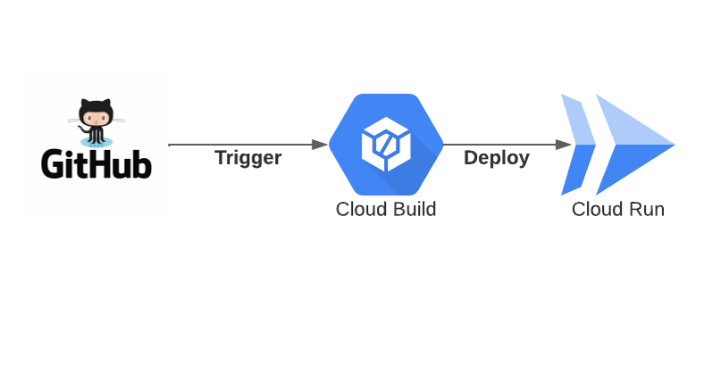

# Deploying-a-Microservice-API-with-Cloud-Run

In this project, we will use Cloud Run with continuous delivery to launch an HTTP microservice from a GitHub repository.

We made use of two gcp services:

* cloud build: build container images

* cloud run: creates and deploys highly scalable containerized apps on a fully managed serverless platform.

Furthermore, with cloud run, we can control traffic by separating it among application versions.

Finally, we may develop a service level objective (SLO), which is a quantifiable aim for service performance over time (Observability)

Technologies used in this project:
-	Cloud provider: GCP
- Git	
- Cloud build
- Cloud run
